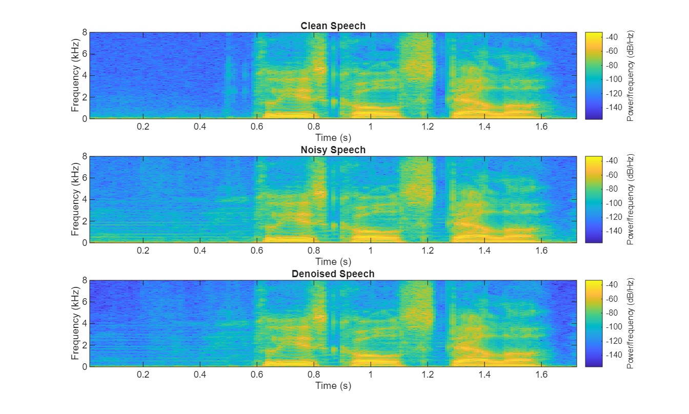
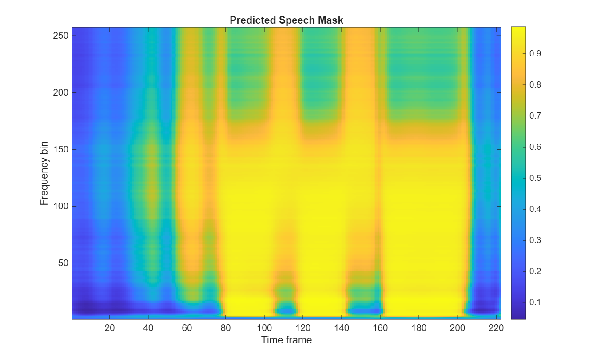
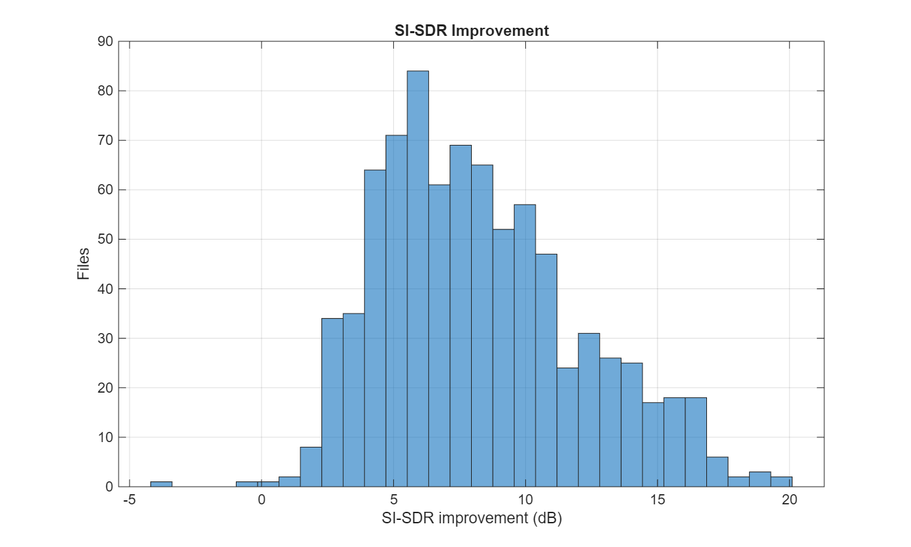

# Deep Learning Based Background Noise Suppression for Speech

A MATLAB implementation for speech background-noise suppression using a trained **BiLSTM mask-estimation network**. The system converts noisy speech into a time-frequency representation, predicts a speech-preserving mask, applies the mask to the noisy magnitude spectrum, and reconstructs enhanced speech using the noisy phase.

> **Final submission version:** v7  
> **Platform:** MATLAB  
> **Primary task:** Speech enhancement / background noise suppression

---

## Highlights

| Item | Final v7 configuration / result |
|---|---:|
| Test files evaluated | **824** |
| Training sequences | **12,000** |
| Validation sequences | **1,500** |
| Training epochs | **30** |
| BiLSTM hidden units | **256** |
| Fully connected units | **512** |
| Sampling rate | **16 kHz** |
| STFT window | **512 samples** |
| STFT overlap | **384 samples** |
| FFT length | **512** |
| STFT frequency bins | **257** |
| Inference sequence length | **100 frames** |
| Magnitude compression | **0.50** |
| Training time | **59.44 min** |

### Final objective results

| Metric | Input | Enhanced | Improvement |
|---|---:|---:|---:|
| SNR | 8.450 dB | **16.630 dB** | **+8.180 dB** |
| SI-SDR | 8.449 dB | **16.720 dB** | **+8.271 dB** |
| SegSNR | 1.519 dB | **7.827 dB** | **+6.308 dB** |

These values are taken from the supplied v7 experiment outputs in `results/`.

---

## 1. Project Overview

Background noise can significantly reduce speech intelligibility and degrade the performance of downstream systems such as speech recognition, voice communication, and human-machine interfaces. This project uses deep learning to estimate a time-frequency speech mask directly from noisy speech.

The trained model learns the relationship between noisy speech spectral features and a target mask. During inference, the predicted mask suppresses spectral components associated with background noise while retaining components likely to belong to speech.

### Processing pipeline

```text
Noisy Speech
     │
     ▼
Mono Conversion / Resampling
     │
     ▼
STFT
     │
     ▼
Log-Magnitude Features
     │
     ▼
Saved v7 Normalization
     │
     ▼
BiLSTM Mask Estimator
     │
     ▼
Sigmoid Speech Mask
     │
     ▼
Mask × Noisy Magnitude
     │
     ├──────────────► Noisy Phase
     │
     ▼
Complex Spectrum Reconstruction
     │
     ▼
Inverse STFT / Overlap-Add
     │
     ▼
Enhanced Speech
```

---

## 2. Model Architecture

The supplied v7 model contains a sequence-processing network with the following documented configuration:

- **Input:** 257-dimensional STFT log-magnitude feature vector per frame
- **Sequence length used during inference:** 100 frames
- **BiLSTM hidden units:** 256
- **Fully connected layer:** 512 units
- **Output:** frequency-bin speech mask
- **Output activation:** sigmoid
- **Mask range:** 0 to 1

The model and its exact learned parameters are provided in:

```text
model/speechDenoisingBiLSTM_v7.mat
```

The model file also stores the v7 feature normalization statistics (`featMean` and `featStd`) required for consistent inference.

---

## 3. Signal Processing

### STFT configuration

The final v7 system uses:

- Sampling frequency: **16,000 Hz**
- Window: **512 samples**
- Overlap: **384 samples**
- Hop size: **128 samples**
- FFT length: **512**
- One-sided frequency bins: **257**
- Periodic Hann window

For a noisy signal `x[n]`, the STFT produces a complex spectrum:

```text
X(k,t) = |X(k,t)| exp(jφ(k,t))
```

The magnitude is converted to a log-domain feature:

```text
F(k,t) = log(|X(k,t)| + 1e-6)
```

The feature matrix is normalized using the statistics saved with the trained v7 model.

### Mask-based enhancement

The network predicts a mask `M(k,t)` using a sigmoid output. The enhanced magnitude is calculated as:

```text
|Y(k,t)| = M(k,t) · |X(k,t)|
```

The phase of the noisy input is retained for reconstruction:

```text
Y(k,t) = |Y(k,t)| exp(jφ_X(k,t))
```

The enhanced waveform is then reconstructed through inverse FFT and overlap-add processing.

---

## 4. Repository Structure

```text
Speech-Background-Noise-Suppression-v7/
│
├── README.md
├── LICENSE
├── CITATION.cff
├── .gitignore
│
├── src/
│   ├── run_denoising_v7.m
│   └── test.m
│
├── model/
│   └── speechDenoisingBiLSTM_v7.mat
│
├── results/
│   ├── objective_results.csv
│   ├── final_results_summary.txt
│   ├── figures/
│   │   ├── Improvement_vs_InputSNR.png
│   │   ├── Metric_Summary.png
│   │   ├── Predicted_Mask.png
│   │   ├── SISDR_Improvement_Histogram.png
│   │   └── Spectrogram_Comparison.png
│   └── audio/
│       ├── clean_*.wav
│       ├── noisy_*.wav
│       └── denoised_*.wav
│
├── data/
│   └── sample_inputs/
│
├── docs/
│   ├── methodology.md
│   ├── results.md
│   └── reproducibility.md
│
```

---

## 5. Requirements

Recommended environment:

- MATLAB **R2022b or newer**
- Deep Learning Toolbox
- Signal Processing Toolbox
- A MATLAB installation capable of loading the supplied `.mat` model

GPU acceleration is not required for inference. Training a model of this size is substantially more practical with GPU support.

See `docs/reproducibility.md` for the inference procedure and code organization.

---

## 6. Running the Final v7 Model

### Step 1 — Open the repository in MATLAB

Set the repository root as the MATLAB working directory or add it to the MATLAB path.

### Step 2 — Run the portable inference script

Open:

```text
src/run_denoising_v7.m
```

Run it from MATLAB.

### Step 3 — Select a noisy WAV file

The script opens a file-selection dialog. Select a WAV speech recording.

The script automatically:

1. Loads `speechDenoisingBiLSTM_v7.mat`.
2. Loads the saved v7 normalization statistics.
3. Converts stereo input to mono when necessary.
4. Resamples the signal to 16 kHz.
5. Computes the STFT.
6. Extracts log-magnitude features.
7. Normalizes the features using the saved v7 statistics.
8. Predicts the speech mask in 100-frame chunks.
9. Applies the mask to the noisy magnitude spectrum.
10. Reconstructs the enhanced waveform using the noisy phase.
11. Saves the result as `<input_name>_denoised.wav`.
12. Displays waveform and spectrogram comparisons.

No training data is required for inference.

---

## 7. Results

The final supplied experiment evaluated **824 files**.

### Quantitative performance

The system improved average SNR from **8.45 dB to 16.63 dB**, corresponding to an improvement of **8.18 dB**.

Average SI-SDR improved from **8.449 dB to 16.720 dB**, an improvement of **8.271 dB**.

Average SegSNR improved from **1.519 dB to 7.827 dB**, an improvement of **6.308 dB**.

### Visual results

The repository includes:

- `Spectrogram_Comparison.png` — noisy/enhanced spectral comparison
- `Predicted_Mask.png` — predicted speech mask
- `Metric_Summary.png` — metric summary
- `Improvement_vs_InputSNR.png` — improvement as a function of input SNR
- `SISDR_Improvement_Histogram.png` — SI-SDR improvement distribution

Open these files from `results/figures/` when presenting the project.

---

## 8. Visual Results

### Spectrogram comparison



### Predicted speech mask



### SI-SDR improvement distribution



## 8. Audio Examples

Representative clean, noisy, and denoised WAV files are included in `results/audio/`.

These examples are provided for qualitative inspection and demonstration. The complete evaluation dataset is **not redistributed in this repository**.

---

## 9. Dataset

The full speech/noise dataset used for training and evaluation is not included because the supplied project files do not establish redistribution rights for the underlying recordings.

For a reproducible academic experiment, obtain the appropriate dataset through its original source, preserve its licensing terms, and configure the training pipeline accordingly.

Only a small set of sample WAV inputs from the supplied project is included for demonstrating inference.

---

## 10. Code Organization

The `src/` folder contains the two MATLAB scripts used for the final submission:

- `run_denoising_v7.m` — portable inference script that loads the supplied v7 model and processes an input WAV file.
- `test.m` — original evaluation/test implementation supplied with the final project results.

The repository does not include a verified v7 training script. The supplied `ssproject.m` was an earlier experimental/unverified training draft and has intentionally been excluded from this final submission repository to avoid confusion.

## 11. Limitations

1. The final reconstruction uses the **phase of the noisy input** rather than estimating clean phase.
2. The supplied repository does not contain the complete original training dataset.
3. The exact v7 training source is not included in this repository; the available training draft was not verified as the source of the reported v7 model.
4. Objective metrics such as SNR and SI-SDR do not completely describe perceived speech quality.
5. The inference implementation processes the signal in chunks and is not a validated low-latency streaming deployment.

---

## 12. Future Improvements

Possible future extensions include:

- Complex-valued mask estimation
- Phase-aware speech enhancement
- Multi-condition noise augmentation
- STOI and PESQ evaluation where licensing/tool availability permits
- Causal or low-latency recurrent architectures
- GPU-optimized batch inference
- Real-time microphone input
- Deployment to embedded or edge hardware

---

## 13. Academic Note

This repository is prepared as a technical project submission and documentation package. Numerical results reported here correspond to the supplied v7 experiment artifacts and should not be interpreted as a guarantee of identical performance on a different dataset, split, MATLAB version, or preprocessing pipeline.

---

## 14. Author

**Rajeev Gaddam**  
Electronics & Computer Science / Computer Engineering

---

## License

The source-code portions of this repository are released under the MIT License unless otherwise stated. Dataset recordings and third-party materials remain subject to their respective licenses and are not relicensed by this repository.
